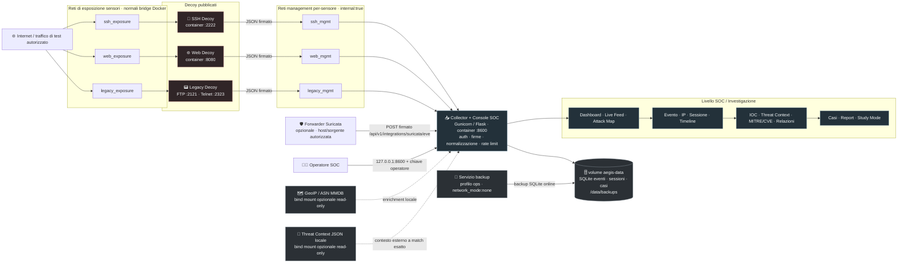

<p align="center"><a href="README.md">🇬🇧 English</a> · <a href="README.it.md">🇮🇹 Italiano</a></p>

<p align="center">
  
  
  
  
  
  
</p>

# 🛡️ AEGIS-NEXUS

> Telemetria honeypot, investigazione SOC, threat research e apprendimento della cybersecurity in un’unica piattaforma evidence-first.

<p align="center"><a href="SECURITY.md">Sicurezza</a> · <a href="docs/THREAT_MODEL.md">Threat model</a> · <a href="docs/PRIVACY.md">Privacy e retention</a> · <a href="docs/INVESTIGATION.md">Flusso investigativo</a> · <a href="docs/OPERATIONS.md">Operazioni</a> · <a href="LICENSE">Licenza MIT</a></p>

---

## 📖 Cos’è AEGIS-NEXUS

AEGIS-NEXUS è una piattaforma **Honeypot + SOC Analysis + Threat Research + Cybersecurity Learning Lab**. Espone decoy volutamente limitati SSH, web, FTP e Telnet, raccoglie telemetria ostile tramite canali sensore autenticati e la trasforma in un flusso investigativo senza eseguire comandi o payload forniti dall’attaccante.

La regola centrale è la provenienza: **dati osservati, enrichment esterni, analisi derivate e ipotesi restano separati**, mentre i metadata di normalizzazione controllati dal collector dichiarano esplicitamente eventuali troncamenti, redazioni o trasformazioni. GeoIP, ASN, match di threat context locale, estrazione IOC, mapping MITRE ATT&CK e riferimenti CVE non vengono mai presentati come fatti se l’evidenza memorizzata non li supporta.

## ✨ Funzionalità principali

- Decoy isolati SSH, web, FTP e Telnet con segreti distinti per sensore e telemetria firmata.
- Collector Flask/Gunicorn con ingestione JSON bounded, rate limit, validazione dell’input ostile e persistenza SQLite.
- Correlazione delle sessioni tramite ID espliciti delle connessioni o flow Suricata quando disponibili, con fallback temporale.
- Dashboard SOC con ricerca e filtri globali, Live Feed, attacks over time, IP unici, paesi, ASN, porte, protocolli, servizi, honeypot, credential, comandi, payload, alert IDS, IOC, MITRE/CVE e heatmap temporali.
- Attack Map interattiva basata esclusivamente su enrichment geografici memorizzati.
- Flusso evento → IP → sessione → timeline → evidenze → enrichment → relazioni → caso → report → Study Mode.
- Gestione casi SOC evidence-preserving con note analista, tag, audit trail e report JSON/CSV/Markdown.
- Enrichment GeoIP/ASN offline da file MMDB MaxMind forniti dall’operatore.
- Threat context offline a match esatto da feed JSON locale; gli indicatori raccolti non vengono inviati a servizi di terze parti.
- Estrazione deterministica di IOC/artefatti da comandi e payload osservati senza etichettare automaticamente i valori come malevoli.
- Ingestione nativa di eventi Suricata EVE JSON.
- Interfaccia bilingue IT/EN tramite dizionari i18n centrali.
- Container hardenizzati: runtime non-root, filesystem read-only, capability rimosse, `no-new-privileges`, limiti di risorse e reti management separate.
- Binding CIDR management per sensore: le identità dei decoy built-in sono accettate soltanto dalla subnet interna attesa e le trust zone dei sensori non possono raggiungere API operatore/UI.
- Egress guard Linux host-side su `DOCKER-USER` per bloccare nuove connessioni originate dai decoy mantenendo il traffico di risposta delle porte honeypot pubblicate.
- Evidence Integrity con metadata collector separati, indicatori di troncamento/redazione e fingerprint credenziali calcolati sul valore originale prima dei limiti di storage.
- Retention temporale/capacitiva, backup SQLite online, readiness check e paginazione storica bounded.

## 🗺️ Diagramma dell’architettura



Il diagramma rappresenta la topologia Compose predefinita. I tre decoy **non** condividono una rete management laterale: ogni sensore dispone della propria rete di esposizione e della propria rete management `internal: true` collegata al collector. Le reti di esposizione sono normali bridge Docker e quindi **non costituiscono un controllo egress**; nei deployment esposti a Internet il traffico in uscita va limitato tramite firewall host/VLAN.

La console SOC viene pubblicata per default soltanto su `127.0.0.1:8600`. Le porte dei sensori vengono pubblicate sull’host senza bind loopback, quindi la loro reale raggiungibilità da Internet dipende da host Docker, firewall e NAT. L’helper Suricata opzionale invia gli eventi all’endpoint di ingestione del collector; il forwarding remoto deve usare un percorso autorizzato protetto da TLS, senza esporre direttamente la console operatore.

Il servizio di backup condivide soltanto il volume persistente `aegis-data` e viene eseguito con `network_mode: none`.

**Flusso dati:** `attaccante/traffico di test → rete di esposizione → decoy → evento normalizzato firmato → rete management interna → collector → validazione/correlazione/enrichment → SQLite → dashboard/investigazione/casi/report`.

## 🧭 Modello investigativo

AEGIS mantiene distinte quattro classi di provenienza:

1. **Observed / Osservato** — fatti catturati direttamente da decoy o IDS.
2. **Enrichment** — contesto esterno/locale con fonte e timestamp.
3. **Derived / Derivato** — artefatti, IOC, MITRE o CVE supportati da evidenza.
4. **Hypotheses / Ipotesi** — interpretazioni dell’analista che devono restare visibilmente separate dai fatti.

Il normale flusso dell’analista è:

`Dashboard → evento → IP → sessione → timeline → credential/comandi/payload → Threat Intelligence/enrichment → MITRE/CVE/IOC → relazioni → caso → report → Study Mode`

Consulta [Flusso investigativo](docs/INVESTIGATION.md) per il modello completo delle evidenze.

## 🚀 Guida all’installazione

### 1. Prerequisiti

Deployment consigliato:

- Git
- Docker Engine / Docker Desktop
- Docker Compose v2 (`docker compose version` deve funzionare)
- porte host libere `2222`, `8080`, `2121`, `2323` e porta locale `8600`
- per gli esempi CLI: `curl`, client OpenSSH e `nc`/netcat

Python 3.12+ serve per lo sviluppo locale diretto e per eseguire dall’host gli script Python inclusi, ad esempio il forwarder Suricata.

### 2. Clona il repository

```bash
git clone https://github.com/chiaraberti13/AEGIS-NEXUS.git
cd AEGIS-NEXUS
```

### 3. Crea il file di configurazione

```bash
cp .env.example .env
```

Genera un valore ad alta entropia diverso per **ogni** sensore e per l’accesso operatore:

```bash
python -c "import secrets; print(secrets.token_urlsafe(48))"
```

Esegui il comando quattro volte e inserisci valori differenti in `.env`:

```text
AEGIS_SSH_SENSOR_API_KEY=<segreto-casuale-1>
AEGIS_WEB_SENSOR_API_KEY=<segreto-casuale-2>
AEGIS_LEGACY_SENSOR_API_KEY=<segreto-casuale-3>
AEGIS_OPERATOR_API_KEY=<segreto-casuale-4>
```

Lascia `AEGIS_INGEST_API_KEY` vuota quando utilizzi l’allowlist per-sensore predefinita. Imposta `AEGIS_SURICATA_SENSOR_API_KEY` soltanto se utilizzi l’ingestione Suricata. Non committare il file `.env`.

### 4. Costruisci e avvia AEGIS-NEXUS

```bash
docker compose up -d --build
```

Controlla lo stato dei container:

```bash
docker compose ps
```

Controlla la readiness del collector:

```bash
curl -fsS http://127.0.0.1:8600/health
```

Un collector sano restituisce:

```json
{"status":"ok"}
```

### 5. Apri la console SOC

Apri:

**http://127.0.0.1:8600**

Quando richiesto inserisci il valore di `AEGIS_OPERATOR_API_KEY` presente nel file `.env`. Il browser lo conserva soltanto in `sessionStorage`; chiudendo la sessione o usando il pulsante di blocco viene rimosso.

## 🔌 Porte predefinite

| Componente | Endpoint host | Funzione |
|---|---:|---|
| SSH decoy | `host:2222` | Interazione SSH emulata e telemetria dei comandi |
| Web decoy | `http://host:8080` | Telemetria login, richieste e payload |
| FTP decoy | `host:2121` | Telemetria credential legacy |
| Telnet decoy | `host:2323` | Telemetria credential legacy |
| Console SOC | `http://127.0.0.1:8600` | Dashboard e API riservate all’operatore |

Le porte dei sensori possono essere modificate tramite le variabili `AEGIS_PUBLIC_*_PORT`. A differenza della console, i sensori non sono vincolati a loopback per default: limita l’esposizione con firewall/NAT. Mantieni privata la console operatore; per accesso remoto usa TLS e controlli perimetrali, ad esempio partendo da `deploy/nginx.conf.example`.

## 🎮 Istruzioni d’uso

### Genera telemetria locale in sicurezza

Usa esclusivamente credenziali e dati di test. Non digitare mai password reali dentro un honeypot.

SSH:

```bash
ssh -p 2222 demo@127.0.0.1
# nella shell emulata prova: pwd, ls, uname -a
```

Web:

```bash
curl http://127.0.0.1:8080/
curl -X POST http://127.0.0.1:8080/login -d "username=demo&password=demo"
curl "http://127.0.0.1:8080/internal-db?q=status"
```

FTP/Telnet con `nc`:

```bash
printf "USER demo\r\nPASS demo\r\nQUIT\r\n" | nc 127.0.0.1 2121
printf "demo\r\ndemo\r\n" | nc 127.0.0.1 2323
```

Gli eventi risultanti compaiono nel Live Feed e diventano disponibili per ricerca, correlazione delle sessioni, grafo delle relazioni, casi, report e Study Mode.

### Investiga un evento

1. Apri **Dashboard** e usa finestra temporale, ricerca o grafici analitici per restringere il dataset.
2. Seleziona un elemento nel **Live Feed** o nella **Attack Map**.
3. Controlla i quattro blocchi di provenienza: Observed, Enrichment, Derived e Hypotheses.
4. Apri il **profilo IP** sorgente e la **sessione** correlata.
5. Esamina timeline, credential, comandi, payload, alert IDS, IOC, contesto Threat Intelligence e mapping MITRE/CVE supportati da evidenza.
6. Apri **Relazioni** per analizzare i collegamenti tra eventi, sessioni, IP, porte, ASN, credential, payload, IOC e mapping.
7. Crea o aggiorna un **Caso**, collega le evidenze evento/sessione e aggiungi note analista.
8. Esporta report JSON/CSV/Markdown oppure apri **Study Mode** per una lettura didattica basata sulle evidenze.

### Investigazione storica

Il Live Feed mostra la telemetria recente. Nella vista Investigazione usa **Carica eventi precedenti** per aggiungere eventi storici coerenti con ricerca e filtri correnti. La paginazione usa cursori opachi stabili invece di offset.

## 🌍 Enrichment GeoIP / ASN locale opzionale

AEGIS può usare file MMDB MaxMind GeoIP2/GeoLite2 forniti dall’operatore senza inviare gli IP raccolti a un’API esterna.

```bash
mkdir -p geoip
# inserisci GeoLite2-City.mmdb e GeoLite2-ASN.mmdb in ./geoip
docker compose -f docker-compose.yml -f docker-compose.geoip.yml up -d --build
```

Consulta [Enrichment locale](docs/ENRICHMENT.md).

## 🔎 Threat Context locale opzionale

AEGIS può confrontare con match esatto IP osservati e artefatti URL/dominio/hash derivati con un feed JSON locale. I match restano contesto esterno e non modificano automaticamente la severità, non creano CVE/MITRE e non attribuiscono un actor.

```bash
mkdir -p threat-context
# inserisci feed.json in ./threat-context
docker compose -f docker-compose.yml -f docker-compose.threat-context.yml up -d --build
```

Consulta [Threat context locale](docs/THREAT_CONTEXT.md) per lo schema del feed.

I due overlay opzionali possono essere abilitati insieme:

```bash
docker compose \
  -f docker-compose.yml \
  -f docker-compose.geoip.yml \
  -f docker-compose.threat-context.yml \
  up -d --build
```

## 🛡️ Ingestione Suricata

Imposta una `AEGIS_SURICATA_SENSOR_API_KEY` indipendente in `.env`. Lo script incluso è un utility Python eseguita sull’host: installa prima il package (`python -m pip install -e .`), quindi inoltra i record EVE JSON:

```bash
export AEGIS_SURICATA_SENSOR_API_KEY="<segreto-suricata-configurato-in-.env>"
python scripts/send_suricata_event.py --file /var/log/suricata/eve.json --sensor suricata-01
```

Gli alert Suricata vengono conservati come telemetria IDS osservata. AEGIS non inventa mapping MITRE o CVE a partire dalla sola signature.

## ⚙️ Operazioni

Visualizza i log del collector:

```bash
docker compose logs -f collector
```

Riavvia il collector:

```bash
docker compose restart collector
```

Crea un backup SQLite online:

```bash
docker compose --profile ops run --rm backup
```

Arresta lo stack senza eliminare il volume del database:

```bash
docker compose down
```

Elimina container **e tutti i dati persistenti di AEGIS**:

```bash
docker compose down -v
```

> ⚠️ `docker compose down -v` elimina definitivamente il volume `aegis-data`. Prima esporta o salva con backup tutto ciò che vuoi conservare.

Per dettagli operativi, readiness, retention, chiavi e TLS consulta [Operazioni](docs/OPERATIONS.md).

## 🧪 Sviluppo locale

```bash
python -m pip install -e ".[dev]"
pytest -q
AEGIS_DATABASE_PATH=./data/aegis.db \
AEGIS_OPERATOR_API_KEY="sostituisci-con-un-segreto-casuale-lungo" \
flask --app aegis_nexus.app run --host 127.0.0.1 --port 8600
```

Il deployment Docker completo è consigliato quando testi i decoy perché applica la separazione di rete e l’hardening dei container previsti dal progetto.

## 📦 Struttura del repository

```text
AEGIS-NEXUS/
├── docker-compose.yml                  stack hardenizzato predefinito
├── docker-compose.geoip.yml            mount opzionale GeoIP/ASN locale
├── docker-compose.threat-context.yml   mount opzionale threat feed locale
├── deploy/                             esempio reverse proxy
├── docs/                               documentazione sicurezza, privacy, operazioni e investigazione
├── scripts/                            backup, forwarding Suricata e utility
├── src/aegis_nexus/
│   ├── app.py                          API collector e console SOC
│   ├── store.py                        persistenza SQLite, analytics e casi
│   ├── model.py                        normalizzazione input ostile
│   ├── correlation.py                  correlazione sessioni
│   ├── derivation.py                   estrazione deterministica artefatti
│   ├── enrichment.py                   GeoIP/ASN locale
│   ├── threat_context.py               threat context locale a match esatto
│   ├── reporting.py                    report investigativi sicuri
│   ├── study.py                        Study Mode IT/EN
│   ├── sensors/                        decoy SSH, web, FTP/Telnet
│   ├── static/                         JS dashboard, i18n e CSS
│   └── templates/                      template console SOC
└── tests/                              test di regressione e sicurezza
```

## 🔒 Sicurezza, privacy e limiti di attribuzione

La telemetria honeypot può contenere indirizzi IP, credential e payload controllati dall’attaccante. Definisci una finalità legittima e un periodo di conservazione, proteggi l’accesso operatore e non pubblicare dati personali o segreti raccolti.

GeoIP, ASN e match di threat context descrivono infrastruttura o contesto esterno. VPN, proxy, NAT, provider hosting e sistemi compromessi possono nascondere l’origine reale. AEGIS-NEXUS non identifica automaticamente una persona, un threat actor, una malware family o una campagna.

Per deployment esposti a Internet usa una VM/VLAN dedicata, nega le rotte verso reti di produzione, limita l’egress dei sensori tramite firewall host/rete e usa TLS per l’accesso operatore remoto.

Prima di esporre i decoy a Internet leggi [Sicurezza](SECURITY.md), [Threat model](docs/THREAT_MODEL.md), [Privacy e retention](docs/PRIVACY.md) e [Isolamento sensori](docs/SENSOR_ISOLATION.md).

## 📄 Licenza e uso responsabile

Distribuito con [licenza MIT](LICENSE). Usa AEGIS-NEXUS esclusivamente su infrastrutture di tua proprietà o per le quali possiedi un’autorizzazione esplicita. Non usarlo per contro-attaccare, accedere a sistemi di terzi o pubblicare credential/dati personali raccolti.

---

© Chiara Berti — 2026
