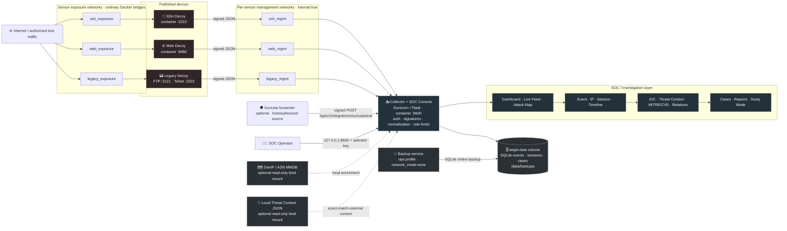

<p align="center">
  
</p>

<p align="center"><a href="README.md">🇬🇧 English</a> · <a href="README.it.md">🇮🇹 Italiano</a></p>

<p align="center">
  
  
  
  
  
  
</p>

> An evidence-first bilingual honeypot and SOC analysis platform for attack monitoring, investigation, threat research and cybersecurity learning.

<p align="center"><a href="ROADMAP.md">Roadmap</a> · <a href="SECURITY.md">Security</a> · <a href="docs/THREAT_MODEL.md">Threat model</a> · <a href="docs/DATA_PROVENANCE.md">Data provenance</a> · <a href="docs/NETWORK_EVIDENCE.md">Network evidence</a> · <a href="docs/PRIVACY.md">Privacy & retention</a> · <a href="docs/INVESTIGATION.md">Investigation</a> · <a href="docs/OPERATIONS.md">Operations</a> · <a href="LICENSE">Licence</a></p>

> [!IMPORTANT]
> Deploy honeypot sensors only on infrastructure you own or are explicitly authorized to monitor. Review the security, privacy and isolation documentation before exposing decoys to the Internet.

---

## 📖 What AEGIS-NEXUS is

AEGIS-NEXUS is a **Honeypot + SOC Analysis + Threat Research + Cybersecurity Learning Lab**. It exposes deliberately limited SSH, web, FTP and Telnet decoys, collects hostile telemetry through authenticated sensor channels and turns it into an investigation workflow without executing attacker-supplied commands or payloads.

The central design rule is provenance: **observed data, external enrichment, derived analysis and hypotheses remain separate**, while collector-controlled normalization metadata explicitly discloses truncation, redaction and other transformations. GeoIP, ASN, local threat-context matches, IOC extraction, MITRE ATT&CK mappings and CVE references are never presented as facts unless the stored evidence supports them.

## ✨ Key capabilities

- Isolated SSH, web, FTP and Telnet decoys with per-sensor secrets and signed telemetry.
- Flask/Gunicorn collector with bounded JSON ingestion, rate limits, hostile-input validation and SQLite persistence.
- Session correlation using explicit decoy connection IDs or Suricata flow identity when available, with temporal fallback.
- SOC dashboard with global search and filters, Live Feed, attacks over time, unique IPs, countries, ASN, ports, protocols, services, honeypots, credentials, commands, payloads, IDS alerts, IOC, MITRE/CVE and temporal heatmaps.
- Interactive Attack Map based only on stored geolocation enrichment.
- Event → IP → session → timeline → evidence → enrichment → relations → case → report → Study Mode investigation flow.
- Evidence-preserving SOC case management with analyst notes, tags, audit trail and JSON/CSV/Markdown reports.
- Offline GeoIP/ASN enrichment from operator-supplied MaxMind MMDB files.
- Offline exact-match threat context from an operator-supplied JSON feed; captured indicators are never sent to third-party services.
- Deterministic IOC/artifact extraction from observed commands and payloads without automatically labelling values as malicious.
- Native Suricata EVE JSON ingestion.
- Versioned network evidence with socket/HTTP/Suricata provenance, flow duration/counters, bounded HTTP metadata, TLS/DNS evidence and an investigation panel.
- Optional operator-only bounded PCAP evidence with per-file/capacity/retention limits, SHA-256 integrity verification and explicit session association; elevated capture privileges remain disabled by default.
- Bilingual IT/EN interface through central i18n dictionaries.
- Hardened containers: non-root runtime, read-only filesystems, dropped capabilities, `no-new-privileges`, resource limits and separate management networks.
- Per-sensor management CIDR binding: built-in decoy identities are accepted only from their expected internal subnet, while sensor trust zones cannot reach operator/UI APIs.
- Linux host-side `DOCKER-USER` egress guard that blocks new decoy-initiated connections while preserving reply traffic for published honeypot ports.
- Evidence Integrity with separate collector metadata, truncation/redaction indicators and credential fingerprints computed from the original value before storage bounds.
- Time/capacity retention, online SQLite backups, readiness checks and bounded historical pagination.

## 🗺️ Architecture Diagram



The diagram reflects the default Compose topology. The three decoys do **not** share a lateral management network: each sensor has its own exposure network and its own `internal: true` management network connected to the collector. The exposure networks are ordinary Docker bridge networks, so they are **not an egress-control boundary**; Internet-facing deployments must restrict outbound traffic with the host/VLAN firewall.

The SOC console is published only on `127.0.0.1:8600` by default. Sensor ports are published on the host without a loopback bind, so their actual Internet reachability depends on the Docker host, firewall and NAT policy. The optional Suricata helper targets the collector ingestion endpoint; remote forwarding should go through an authorized TLS-protected path rather than exposing the operator console directly.

The backup service shares only the persistent `aegis-data` volume and runs with `network_mode: none`.

**Data flow:** `attacker/test traffic → exposure network → decoy → signed normalized event → internal management network → collector → validation/correlation/enrichment → SQLite → dashboard/investigation/cases/reports`.

## 🧭 Investigation model

AEGIS keeps four provenance classes distinct:

1. **Observed** — facts captured directly by a decoy or IDS.
2. **Enrichment** — external/local context with source and timestamp provenance.
3. **Derived** — evidence-backed artifacts, IOC, MITRE or CVE analysis.
4. **Hypotheses** — analyst interpretation that must remain visibly separate from facts.

The normal analyst flow is:

`Dashboard → event → IP → session → timeline → credentials/commands/payload → Threat Intelligence/enrichment → MITRE/CVE/IOC → relations → case → report → Study Mode`

See [Investigation workflow](docs/INVESTIGATION.md) for the complete evidence model.

## 🚀 Installation Guide

### 1. Prerequisites

Recommended deployment:

- Git
- Docker Engine / Docker Desktop
- Docker Compose v2 (`docker compose version` must work)
- free host ports `2222`, `8080`, `2121`, `2323` and local port `8600`
- for the CLI examples: `curl`, an OpenSSH client and `nc`/netcat

Python 3.12+ is required for direct local development and when running the included host-side Python utilities, such as the Suricata forwarder.

### 2. Clone the repository

```bash
git clone https://github.com/chiaraberti13/AEGIS-NEXUS.git
cd AEGIS-NEXUS
```

### 3. Create the environment file

```bash
cp .env.example .env
```

Generate a different high-entropy value for **each** sensor and for the operator account:

```bash
python -c "import secrets; print(secrets.token_urlsafe(48))"
```

Run the command four times and place different values in `.env`:

```text
AEGIS_SSH_SENSOR_API_KEY=<random-secret-1>
AEGIS_WEB_SENSOR_API_KEY=<random-secret-2>
AEGIS_LEGACY_SENSOR_API_KEY=<random-secret-3>
AEGIS_OPERATOR_API_KEY=<random-secret-4>
```

Keep `AEGIS_INGEST_API_KEY` empty when using the default per-sensor allowlist. Set `AEGIS_SURICATA_SENSOR_API_KEY` only if you ingest Suricata telemetry. Do not commit `.env`.

### 4. Build and start AEGIS-NEXUS

```bash
docker compose up -d --build
```

Check container state:

```bash
docker compose ps
```

Check collector readiness:

```bash
curl -fsS http://127.0.0.1:8600/health
```

A healthy collector returns:

```json
{"status":"ok"}
```

### 5. Open the SOC console

Open:

**http://127.0.0.1:8600**

When prompted, enter the value of `AEGIS_OPERATOR_API_KEY` from your `.env`. The browser stores it only in `sessionStorage`; closing the session or using the lock button removes it.

## 🔌 Default ports

| Component | Host endpoint | Purpose |
|---|---:|---|
| SSH decoy | `host:2222` | Emulated SSH interaction and command telemetry |
| Web decoy | `http://host:8080` | Login, request and payload telemetry |
| FTP decoy | `host:2121` | Legacy credential telemetry |
| Telnet decoy | `host:2323` | Legacy credential telemetry |
| SOC console | `http://127.0.0.1:8600` | Operator-only dashboard and API |

The sensor ports can be changed with `AEGIS_PUBLIC_*_PORT` variables. Unlike the console, sensors are not loopback-bound by default: restrict exposure with firewall/NAT policy. Keep the operator console private; for remote access use TLS and perimeter controls such as the example in `deploy/nginx.conf.example`.

## 🎮 Usage Instructions

### Generate safe local telemetry

Use only test credentials and test data. Never type real passwords into a honeypot.

SSH:

```bash
ssh -p 2222 demo@127.0.0.1
# inside the emulated shell try: pwd, ls, uname -a
```

Web:

```bash
curl http://127.0.0.1:8080/
curl -X POST http://127.0.0.1:8080/login -d "username=demo&password=demo"
curl "http://127.0.0.1:8080/internal-db?q=status"
```

FTP/Telnet with `nc`:

```bash
printf "USER demo\r\nPASS demo\r\nQUIT\r\n" | nc 127.0.0.1 2121
printf "demo\r\ndemo\r\n" | nc 127.0.0.1 2323
```

The resulting events appear in the Live Feed and become available to search, session correlation, the relationship graph, cases, reports and Study Mode.

### Investigate an event

1. Open **Dashboard** and use the time window, search bar or analytical charts to narrow the dataset.
2. Select an item in **Live Feed** or on the **Attack Map**.
3. Inspect the four provenance blocks: Observed, Enrichment, Derived and Hypotheses.
4. Open the source **IP profile** and correlated **session**.
5. Review timeline, credentials, commands, payloads, IDS alerts, IOC, Threat Intelligence context and evidence-backed MITRE/CVE mappings.
6. Open **Relations** to inspect connections among events, sessions, IPs, ports, ASN, credentials, payloads, IOC and mappings.
7. Create or update a **Case**, attach event/session evidence and add analyst notes.
8. Export JSON/CSV/Markdown reports or open **Study Mode** for an evidence-based learning walkthrough.

### Historical investigation

The Live Feed shows recent telemetry. In the Investigation view use **Load older events** to append previous matching events without losing the current search/filter scope. Pagination uses stable opaque cursors rather than offsets.

## 🌍 Optional local GeoIP / ASN enrichment

AEGIS can use operator-supplied MaxMind GeoIP2/GeoLite2 MMDB files without sending captured IPs to an external API.

```bash
mkdir -p geoip
# place GeoLite2-City.mmdb and GeoLite2-ASN.mmdb in ./geoip
docker compose -f docker-compose.yml -f docker-compose.geoip.yml up -d --build
```

See [Local enrichment](docs/ENRICHMENT.md).

## 🔎 Optional local Threat Context

AEGIS can exact-match observed IPs and derived URL/domain/hash artifacts against a local JSON feed. Matches remain external context and do not automatically change severity, create CVEs/MITRE mappings or attribute an actor.

```bash
mkdir -p threat-context
# place feed.json in ./threat-context
docker compose -f docker-compose.yml -f docker-compose.threat-context.yml up -d --build
```

See [Local threat context](docs/THREAT_CONTEXT.md) for the feed schema.

Both optional overlays can be enabled together:

```bash
docker compose \
  -f docker-compose.yml \
  -f docker-compose.geoip.yml \
  -f docker-compose.threat-context.yml \
  up -d --build
```

## 🛡️ Suricata ingestion

Set an independent `AEGIS_SURICATA_SENSOR_API_KEY` in `.env`. The included helper is a host-side Python utility: install the package first (`python -m pip install -e .`), then forward EVE JSON records:

```bash
export AEGIS_SURICATA_SENSOR_API_KEY="<suricata-secret-configured-in-.env>"
python scripts/send_suricata_event.py --file /var/log/suricata/eve.json --sensor suricata-01
```

Suricata alerts are stored as observed IDS telemetry. AEGIS does not invent MITRE or CVE mappings from a signature alone.

## ⚙️ Operations

View collector logs:

```bash
docker compose logs -f collector
```

Restart the collector:

```bash
docker compose restart collector
```

Create an online SQLite backup:

```bash
docker compose --profile ops run --rm backup
```

Stop the stack without deleting the database volume:

```bash
docker compose down
```

Delete containers **and all persistent AEGIS data**:

```bash
docker compose down -v
```

> ⚠️ `docker compose down -v` permanently removes the `aegis-data` volume. Export or back up anything you need first.

For operational details, readiness, retention, keys and TLS guidance see [Operations](docs/OPERATIONS.md).

## 🧪 Local development

```bash
python -m pip install -e ".[dev]"
pytest -q
AEGIS_DATABASE_PATH=./data/aegis.db \
AEGIS_OPERATOR_API_KEY="replace-with-a-long-random-secret" \
flask --app aegis_nexus.app run --host 127.0.0.1 --port 8600
```

The complete Docker deployment is recommended when testing the decoys because it applies the network separation and container hardening defined by the project.

## 📦 Repository structure

```text
AEGIS-NEXUS/
├── docker-compose.yml                  default hardened stack
├── docker-compose.geoip.yml            optional local GeoIP/ASN mount
├── docker-compose.threat-context.yml   optional local threat-feed mount
├── deploy/                             reverse-proxy example
├── docs/                               security, privacy, operations and investigation docs
├── scripts/                            backup, Suricata forwarding and utilities
├── src/aegis_nexus/
│   ├── app.py                          collector API and SOC console
│   ├── store.py                        SQLite persistence, analytics and cases
│   ├── model.py                        hostile-input normalization
│   ├── correlation.py                  session correlation
│   ├── derivation.py                   deterministic artifact extraction
│   ├── enrichment.py                   local GeoIP/ASN
│   ├── threat_context.py               local exact-match threat context
│   ├── reporting.py                    safe investigation reports
│   ├── study.py                        IT/EN Study Mode
│   ├── sensors/                        SSH, web, FTP/Telnet decoys
│   ├── static/                         dashboard JS, i18n and CSS
│   └── templates/                      SOC console template
└── tests/                              regression and security tests
```

## 🔒 Security, privacy and attribution

Honeypot telemetry can contain IP addresses, credentials and attacker-controlled payloads. Define a lawful purpose and retention period, protect operator access and do not publish captured personal or secret data.

GeoIP, ASN and threat-context matches describe infrastructure or external context. VPNs, proxies, NAT gateways, hosting providers and compromised systems can obscure the real origin. AEGIS-NEXUS does not automatically identify a person, threat actor, malware family or campaign.

Internet-facing deployments should use a dedicated VM/VLAN, deny routes to production networks, restrict sensor egress at the host/network firewall and use TLS for remote operator access.

Read [Security](SECURITY.md), [Threat model](docs/THREAT_MODEL.md), [Privacy & retention](docs/PRIVACY.md) and [Sensor isolation](docs/SENSOR_ISOLATION.md) before exposing decoys to the Internet.

## 📄 Licence & responsible use

Released under the [MIT License](LICENSE). Use AEGIS-NEXUS only on infrastructure you own or are explicitly authorized to monitor. Do not use it to counter-attack, access third-party systems or publish captured credentials/personal data.

---

<p align="center">
  <sub>Made with 🛡️ by <a href="https://github.com/chiaraberti13">chiaraberti13</a> · © 2026 Chiara Berti</sub>
</p>

---
